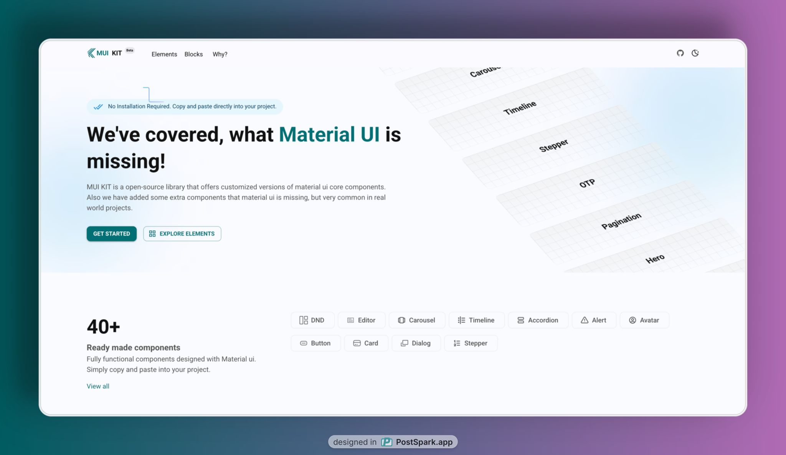

# MUI KIT

[MUI KIT](https://www.muikit.com/) is an open-source Material-UI (MUI) component library built with Next.js, offering a wide range of design variants for core MUI components like Button, Modal, Popover, and more. Our goal is to provide developers with flexible, customizable, and visually diverse components to enhance their React applications.

## Features

- **Extensive Design Variants:**  Multiple styles for MUI components (e.g., Button, Modal, Popover) to suit various design needs.
- **Built with Next.js:** Leverages Next.js for a modern, performant development experience.
- **Customizable:** Easily adapt components to match your project’s theme or branding.
- **Open Source:** Licensed under MIT License to encourage community contributions.

## Prerequisites

- Node.js (v18 or later)
- npm, yarn, or bun

## Installation

1. Clone the code by typing the following command:

```bash
git clone https://github.com/codemine24/mui-kit
```
2. Navigate to the project directory and open the project

```bash
cd mui-kit && code .
```

3. Install packages

```bash
pnpm install
```

4. Running the Development Server

```bash
pnpm run dev
```

Open http://localhost:3000 in your browser to see the component library in action.

---

## Usage

Import components into your React or Next.js project:

```tsx
import { Button } from './components/Button';

export default function Page() {
  return <Button variant="primary" design="rounded">Click Me</Button>;
}
```

- Browse the `/components` directory to explore available components and their design variants.
- Refer to the documentation for usage and customization (see below).

---


## Documentation

> **Coming Soon: (Work in Progress)**
> 
> - Component Reference  
> - Design Variants  
> - Customization Guide  

---


## Contributing

We welcome contributions to enhance our component library! To contribute:

### 1. Fork & Clone

```bash
git clone https://github.com/codemine24/mui-kit.git
```

### 2. Sync with Upstream

```bash
git remote add upstream https://github.com/codemine24/mui-kit.git
git pull upstream main
```

### 3. Create a Branch

e.g.

```bash
git checkout -b feature/new-button-variant
```

### 4. Commit & Push

Follow our commit rules (see below), then push your changes and open a PR to the `main` branch.

---

## Contribution Rules

We use **[Conventional Commits](https://www.conventionalcommits.org/)** to maintain a clean and meaningful Git history.

### Commit Prefixes

| Prefix      | Use When...                                                 |
|-------------|-------------------------------------------------------------|
| `feat:`     | Adding a **new feature**                                     |
| `fix:`      | Fixing a **bug**                                             |
| `refactor:` | Changing **code structure** without altering functionality   |
| `docs:`     | Updating **documentation**                                   |
| `style:`    | Making **formatting changes** (linting, spacing, etc.)       |
| `test:`     | Adding or updating **tests**                                 |
| `chore:`    | **Non-code** changes (config, dependencies, etc.)            |

> Example:

```bash
feat: enhance dropdown responsiveness
```

---

## Built With

Built with ❤️ by fazlyalahi01 and the amazing open source community.

## Badges

[](https://choosealicense.com/licenses/mit/)
